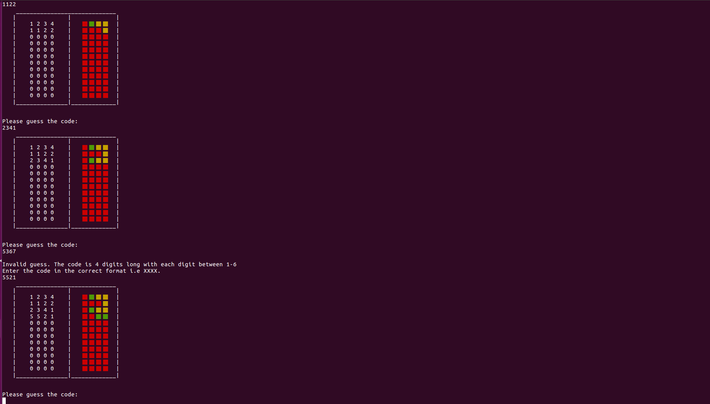

Mastermind
---------------------


This is an implementation of the Mastermind board game, complete with an ai
opponent that will always win in a maximum of 5 turns (using Knuth's algorithm).
The player can choose to be the code-guesser or the code-creator.

Update:
This was not built using the TDD mantra as I hadn't learned about testing at the
time. However, the game still works.

Installation
---------------------
With Ruby (and a bundler) installed, open the command line, navigate to where you want to store
the file and enter the following in your terminal/command-line:
```
$ git clone https://github.com/IvyMic/MasterMind.git
$ cd MasterMind
$ bundle install
$ ruby mastermind.rb

```


Pre thoughts
---------------------

I've never heard of the board game, I thought Mastermind was a quiz show.
I'm super excited about coding an AI player, that would be something I can
show off about I'm sure!

Things I'm concerned about:
1) How to represent the colours
2) I want to allow for duplicates in the colour choices
3) How to code for the AI. There is a maximum 5 turns win method which I want
to try. this means I need to learn a bit more about game theory
4) Organising the code so that the player can choose which type of game
they want to play (guess code or create code)

Things I'm confident on:
1) Having done the tictactoe project, I think I understand the concept of oop
2) I think I know how to keep classes in their own files and require them under
a main file

Post thoughts
---------------------

This was by far my most difficult project yet. In my first attempt I tried to
almost mimick the same structure I had with the tictactoe project. I realise
now that this is bad practice. Every game is its own with its own properties
and the code should take that into account. Also, to represent
the colours, I decided to ask the user for input based on spelling of the colours.
So the user would input "white" if they thought the secret code featured a
"white" entry. Having finished the main game I realised that this was a bad idea,
especially considering how I wanted to implement the ai (I left the resulting
code in the mastermind_first_try.rb file for reference).

Creating the secret code in this way caused multiple issues:

  - Creating the game board. "black" and "white" have 5 characters each but "blue"
    has 4 and "red" has 3. This made creating a visual board on command line
    neatly cumbersome because of the differences in character length
  - The method of attack for the ai involved some game theory and a use of knuth's
    algorithm, which in turn meant the use of some maths. Can't do maths on words
    like "orange" can you?(easily, at least)

My answer to this was to use a hash where the key would be the colours names
and a the value would be a number, and I could use the value when necessary.
But instinctively this all felt unnecessary, so I asked myself why I was so
keen on using string representations of the colours instead of numbers and there
was no real reason except for the fact that I wanted to somehow represent a colour
on the screen. Through googling 'how to represent colour on the command line'
I found a gemfile called colorize and immediately realised that I should just
use numbers 1-6 instead. This made a lot of things simpler, especially for the
ai.

When coding for the ai I came across an issue I wasn't even aware was a thing.
When evaluating to see if the guess was equal to the secret code I was being
'destructive' and was changing the secret code. In the method I had to duplicate
the secret code and work with the duplicate to ensure that method doesnt point to
the secret code and alter it.

Needless to say, I learnt a lot!
I'm really proud of what I produced. Especially the ai, seperating the different
classes into their own .rb files, using a gem, and being able to run the game
multiple times before quitting.

Things to improve on in the future:

1) Have clearer thought before I start coding, it could save me a lot of time.
2) Try not to have different methods that do the same thing.
3) Research to see if there are any gems that can help. gems are not cheating!
4) Respect that each project is unique
